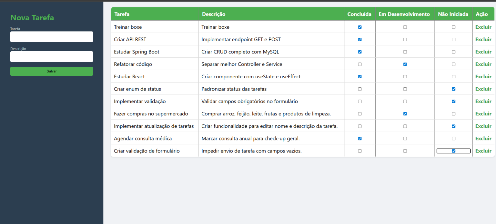

<h1 align="center"> 
	  🚀 TaskManager - gerenciador_de_tarefas_Crud
</h1>

 <a href="#-descrição-do-projeto">Descrição</a> •
 <a href="#-funcionalidades">Funcionalidades</a> •
 <a href="#-arquitetura">Arquitetura</a> •
 <a href="#-como-executar">Como Executar</a> •
 <a href="#-tecnologias">Tecnologias</a> •
 <a href="#-autor">Autor</a>

---

## 📌 Descrição do Projeto

O **TaskManager** é uma aplicação web desenvolvida com **Java e Spring MVC** para gerenciamento de tarefas.

O sistema permite que o usuário organize suas atividades, controlando o status de cada tarefa de forma simples e eficiente.

Este projeto foi desenvolvido com o objetivo de praticar:

- Arquitetura MVC
- Integração com banco de dados MySQL
- Organização de código em camadas (Controller, Service e Repository)
- Desenvolvimento de aplicações web com Spring

---

## ⚙️ Funcionalidades

- ✅ Criar tarefas  
- ✅ Listar tarefas  
- ✅ Excluir tarefas  
- ✅ Definir status da tarefa como:
  - ✔ Concluída  
  - 🔄 Em Desenvolvimento  
  - ⏳ Não Iniciada

	
## 🎨 Layout

  

## ▶️ Como Executar o Projeto 

### 1️⃣ Clonar o repositório

	git clone https://github.com/Joao-vitorSantos08/gerenciador_de_tarefas_Crud.git

2️⃣ Acessar a pasta do projeto

	cd gerenciador_de_tarefas_Crud

3️⃣ Configurar o banco de dados

Abra o arquivo application.properties e configure:

	spring.datasource.url=jdbc:mysql://localhost:3306/gerenciador_de_tarefas
	spring.datasource.username=seu_usuario
	spring.datasource.password=sua_senha

⚠️ Certifique-se de que o MySQL esteja rodando e que o banco gerenciador_de_tarefas já tenha sido criado.

4️⃣ Executar o projeto

No Eclipse:

Clique com o botão direito no projeto

Selecione Run As → Java Application

# 🌐 Acessar no navegador

A aplicação estará disponível em:

http://localhost:8080/tarefa

<!--  ## 🌐 Acesse o Site Online

Você pode visualizar o projeto diretamente no navegador sem precisar baixar:

➡️ [Clique aqui para acessar](https://gustavo-freitas-ai.github.io/AutoElite/) -->

## 📋 Pré-requisitos

Antes de começar, você vai precisar ter instalado em sua máquina:

- ☕ Java 17  
- 🐬 MySQL  
- 🔧 Eclipse IDE (ou outra IDE Java de sua preferência)  
- 🌐 Um navegador web moderno  

### ⚠️ Importante

Se você não estiver utilizando uma IDE que já possua suporte ao Maven integrado (como o Eclipse), será necessário instalar o:

- 🛠 [Apache Maven](https://maven.apache.org/download.cgi)

## 🛠 Tecnologias

- Java 17  
- Spring MVC
- MySQL  
- Thymeleaf  
- HTML & CSS  
- Maven  
- Eclipse  
- Git & GitHub  

## 💪 Como contribuir para o projeto

1. Faça um **fork** do projeto.
2. Crie uma nova branch com as suas alterações: `git checkout -b my-feature`
3. Salve as alterações e crie uma mensagem de commit contando o que você fez: `git commit -m "feature: My new feature"`
4. Envie as suas alterações: `git push origin my-feature`
> Caso tenha alguma dúvida confira este [guia de como contribuir no GitHub](./CONTRIBUTING.md)

---

## 🦸 Autor

<a href="https://br.linkedin.com/in/Joao-vitorSantos08">
João Vitor Santos souza</a>
  
 

---

## 📝 Licença

Este projeto esta sobe a licença [MIT](./LICENSE).

Feito por João Vitor Santos Souza👋🏽

